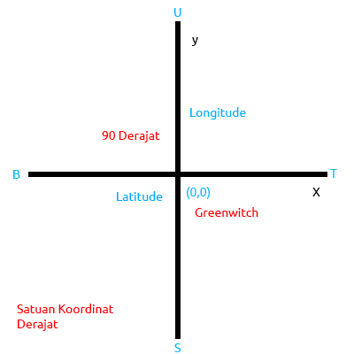

# Resume Pertemuan 1

## Latar Belakang Masalah : 
1. Apa itu Sistem?
2. Apa itu Informasi?
3. Apa itu Sistem Informasi Geografis?
4. Apa itu Koordinat?
5. Apa itu Latitude dan Longitude?
6. Dimana Letak Posisi (0,0) ?
7. Aplikasi yang digunakan ? 

Sistem adalah sesuatu yang saling berhubungan untuk mencapai suatu tujuan yang sama, Informasi yaitu data yang sudah di olah, Jadi Sistem Informasi yaitu data yang sudah diolah dan saling berhubungan untuk mencapat suatu tujuan yang sama

Pengertian Sistem Informasi Geografis Atau (GIS) ialah sebuah sistem komputer yang memiliki kemampuan untuk mengambil, menganalisa, dan menampilkan informasi.

  

Koordinat ialah sekumpulan aturan yang menentukan aturan yang menentukan bagaimana koordinat- koordinat yaitu latitude dan longitude yang bersangkutan merepresentasikan titik titik atau obyek pada suatu peta

Jenis Koordinat dibagi 2 yaitu Latitude dan Longitude
Latitude (Lingkar) Adalah garis yang digunakan untuk menentukan dimana lokasi di Bumi terhadap gariskhatulistiwa (utara atau selatan) , dari 0 derajat hingga 90 derajat.

Longitude (Bujur) Adalah garis yang digunakan untuk menentukan dimana lokasi di Bumi terhadap gariskhatulistiwa (barat atau timur) , dari 0 derajat hingga 180 derajat.

Dimana letak (0,0) itu? letak nya ada di kota atau kecamatan greenwitch yang terdapat di london, inggris
koordinat (0,0) ada disitu dikarena dulu pada masa penjajahan inggris negara yang paling banyak menjajah negara negara lain, atau power of world.
maka pada saat itu ilmuwan - ilmuwan menetapkan greenwitch sebagai pusat koordinat pada saat dulu hingga sekarang.

Aplikasi yang digunakan bisa menggunakan QGIS

## Penutup

**Kesimpulan**

jadi di pertemuan pertama ini dapat disimpulkan untuk mengetahui fungsi dari mempelajari GIS ini, dari mengetahui tata cara perhitungan koordinat dengan latitude dan longitude hingga letak posisi koordinat (0,0).

**Saran**

Ditambahkan nya praktek secara langsung dalam pengujian aplikasi

* Nama : Ali Abdul Wahid
* Kelas : 3A
* Prodi : D4 Teknik Informatika
* Mata Kuliah : Sistem Informasi Geografis

Link Github : https://github.com/aliwebdeveloper/gis/

Referensi :
http://www.zainalhakim.web.id/pengertian-gis.html
http://obengplus.com/artikel/articles/161/1/Membaca-Koordinat-GPS-dengan-Latitude-dan-Longitude.html

Scan Plagiarisme

1. smallseotools - Link
https://drive.google.com/open?id=0BxoQ3Zecy5bzUmpYRUFpM2ZoUXc
2. duplichecker - Link
https://drive.google.com/open?id=0BxoQ3Zecy5bzeWdnckNmU0I3aVU