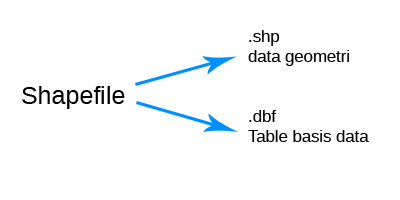
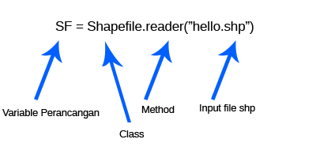
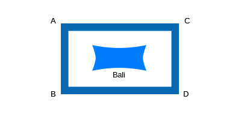

# Sistem Informasi Geografis - Pertemuan 4
RESUME PEMBUATAN METHOD DAN CLASS RETRIEVE DATA GEOSPASIAL

  

## Latar Belakang Masalah :
Retrieve Data Geospasial ialah Meretrieve Data Vektor.

Data shapefile.shp

operasi Retrieve data menggunakan library python yang bernama py.shp

Shapefile : ialah standart file

Vektor Geospasial dikeluarkan oleh ESI

jadi Shapefile dibagi menjadi 2 yaitu 

  

Geometri
Data koordinat yang membentuk bangun datar/ruang diantaranya:

1. Point/titik [1]

2. Line/garis [3] Shape,type

3. Polygon [5]

Operasi Pengambilan Data

Library pyshp class shapefile

1. Buka/baca

2.

  

Method dari DBF

fields

record(n)

Record (n) baris ke (n) records

Method dari SHP

shapes() - Menampilkan semua

shape(n) - Menampilkan dengan parameter

1. bbox

2. parts

3. point s 

4. shape type

bbox

boading box, merupakan batas view peta.

contohnya :

  

Koordinat a,b,c,d itu di sebut bbox

parts

part ialah apakah record ini bagian dari record lain/ precahan relasi

points

koordinat pembentukan peta

shapetype

jenis geometri dari points

## Praktek : 

Menampilkan jumlah record melalui terminal

  

Menampilkan jumlah record dengan py shp

  

main.py

  

1. Buatlah class geospasial editor,

  

Masukan Kode didalam tugas.py

  

2. Buat Method Select, Where Negara (Indonesia)?
Output Data Record Negara Indonesia

Lakukan pengujian

  

## Penutup
**Kesimpulan**
jadi pada pertemuan 4 ini , kita dapat mengetahui bagaimana membuat class dan penggunaan method method yang terdapat pada retrieve datasulitnya memahami penggunaan method, kurang nya latihan praktek di kelas, diperbanyak praktek di dalam kelas nya

**Saran**
sulitnya memahami penggunaan method, kurang nya latihan praktek di kelas, diperbanyak praktek di dalam kelas nya